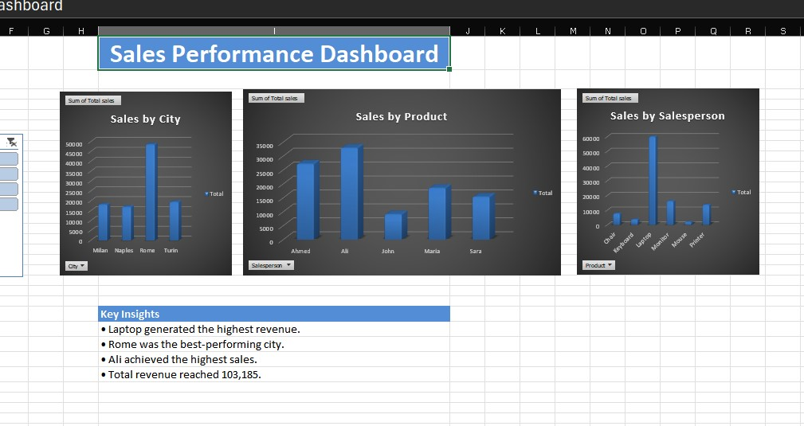

# Sales Performance Dashboard

## Project Overview

This project is an interactive Sales Performance Dashboard built in Microsoft Excel.

The dashboard analyzes sales performance across products, cities, and salespeople using Pivot Tables, Pivot Charts, KPI Cards, and Slicers.

## Dashboard Preview

## Tools Used

- Microsoft Excel
- Pivot Tables
- Pivot Charts
- Slicers
- KPI Cards

## Business Questions Answered

- Which product generated the highest revenue?
- Which city generated the highest sales?
- Which salesperson performed best?
- What was the total revenue?

## Key Findings

- Laptop generated the highest revenue.
- Rome was the best-performing city.
- Ali achieved the highest sales.
- Total revenue reached 103,185.

## Dashboard Features

- Interactive City Slicer
- Dynamic Pivot Charts
- KPI Summary Cards
- Business Insights Section

## Skills Demonstrated

- Data Cleaning
- Data Analysis
- Dashboard Design
- Data Visualization
- Business Reporting

## Files

- sales performance dashboard.xlsx
- screenshot.jpg
